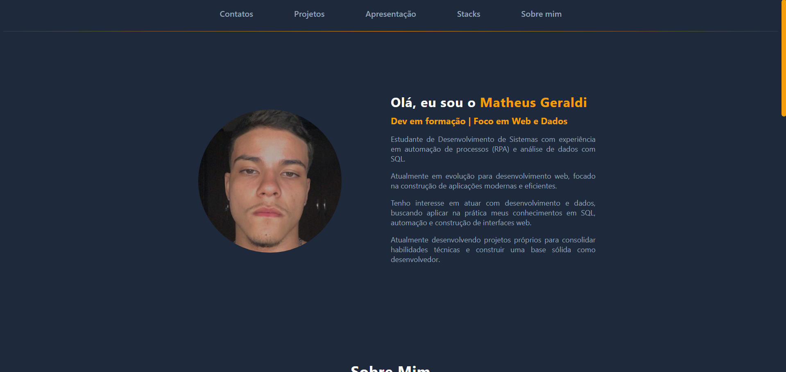

# 🚀 Portfólio Pessoal - Matheus Geraldi

Este repositório contém o meu portfólio pessoal, desenvolvido para apresentar minha trajetória, projetos e evolução no desenvolvimento web.

---

## 🔗 Acesse o Projeto

👉 **https://geraldimatheus.github.io/Portfolio-Pessoal/**

---

## 📸 Preview

---

## 👨‍💻 Sobre o Projeto

O portfólio foi desenvolvido com foco em apresentar informações de forma clara, organizada e com uma interface moderna.

---

## ⚙️ Funcionalidades

- Navegação entre seções com scroll suave  
- Layout responsivo (desktop e mobile)  
- Seção de projetos com preview e links  
- Exibição visual de tecnologias  
- Links diretos para contato  

---

## 🛠️ Tecnologias

---

## 📁 Estrutura do Projeto

📦 portfolio
┣ 📜 index.html
┣ 📜 style.css
┗ 📂 images

---

## 🎯 Objetivo

Consolidar meus conhecimentos em desenvolvimento front-end e servir como base para projetos mais avançados.

---

## ✉️ Contato

- LinkedIn: https://www.linkedin.com/in/geraldimatheus/  
- Email: geraldimatheus07@gmail.com  
- GitHub: https://github.com/geraldimatheus  

---

⭐ Se gostou do projeto, considere dar uma estrela!

---

**Desenvolvido por Matheus Geraldi - 2026**